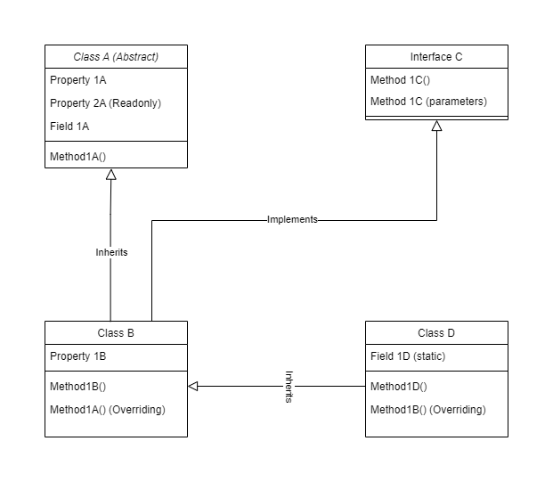

# NETLearning

<!-- dotnet new gitignore -->

# This Repository contains all my Assignment and my final Lab Report

# Assignment-1(Starter)

1. Create a new console application named Greeter under Assignment 1 folder.
2. Modify Program.cs to define a variable fullName and assign some name.
3. Print value of fullName to console.
4. Define another variable cFullName and initilize it with fullName in uppercase letters. (Hint: ToUpper() string helper)
5. Print value of cFullName to console in format: "Hello, ANISHA NAYAJU Ji!"
6. Instead of initilizing fullName, get it from user. (Hint: Console.ReadLine())
7. Now also ask user to enter his/her "Date of Birth" and display user friendly date to console. At this point your output should look like assuming user enters dob as "2010/12/12": (Hint: DateTime.Parse(dateString))
8. Your last task is to calculate his/her age as accurate as possible and dispaly it to console. (Hint: If you subract dob from current date, you will get TimeSpan value, TimeSpan will have properties like .TotalDays, .TotalHours etc.) End output will be like:

# Assignment-2(OOPS Concept)

Here I have taken Banking System as a real world scenario where I design classe(s), interface(s) and members as shown in following class diagram:

